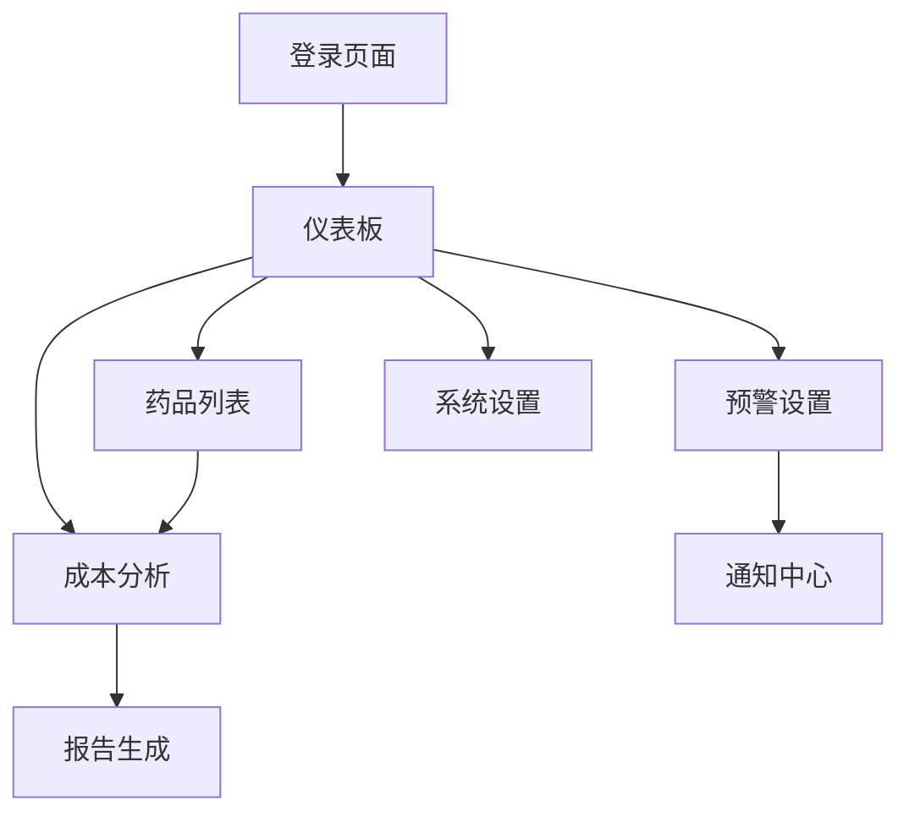

## 1. 产品概述
药品成本分析系统是一个现代化的Web应用，旨在帮助医药企业和医疗机构分析药品成本结构、优化采购策略。系统提供直观的成本数据可视化、多维度分析和智能预测功能，助力用户做出更明智的药品采购和定价决策。

目标用户包括医药采购经理、财务分析师、医院药剂科人员等专业人士，通过数据驱动的洞察降低药品采购成本，提高运营效率。

## 2. 核心功能

### 2.1 用户角色
| 角色 | 注册方式 | 核心权限 |
|------|----------|----------|
| 普通用户 | 邮箱注册 | 查看基础成本数据、生成简单报表 |
| 高级分析师 | 邮箱+审核认证 | 使用高级分析工具、导出详细报告、设置预警规则 |
| 管理员 | 内部创建 | 用户管理、数据源配置、系统设置 |

### 2.2 功能模块
药品成本分析系统包含以下核心页面：
1. **登录页面**：用户认证、密码重置、记住登录状态
2. **仪表板页面**：成本概览、关键指标、趋势图表、快捷入口
3. **药品列表页面**：药品搜索、筛选排序、成本对比、详情查看
4. **成本分析页面**：多维度分析、图表展示、数据导出、报告生成
5. **预警设置页面**：规则配置、阈值设定、通知管理、历史记录

### 2.3 页面详情
| 页面名称 | 模块名称 | 功能描述 |
|----------|----------|----------|
| 登录页面 | 用户认证 | 输入邮箱密码登录，支持忘记密码功能，记住登录状态7天 |
| 登录页面 | 国际化切换 | 支持中英文切换，保存语言偏好设置 |
| 仪表板页面 | 成本概览 | 显示总成本、平均成本、成本变化趋势等关键指标 |
| 仪表板页面 | 图表展示 | 柱状图、折线图、饼图等多种图表展示成本数据 |
| 仪表板页面 | 快捷操作 | 快速访问常用功能，如新增分析、查看报告等 |
| 药品列表页面 | 搜索筛选 | 按药品名称、分类、价格区间等条件搜索筛选 |
| 药品列表页面 | 成本对比 | 横向对比不同药品成本，支持多选对比 |
| 药品列表页面 | 批量操作 | 批量导出、批量标记、批量分析等操作 |
| 成本分析页面 | 多维度分析 | 按时间、地区、供应商、药品类型等维度分析 |
| 成本分析页面 | 图表配置 | 自定义图表类型、颜色、数据范围等显示选项 |
| 成本分析页面 | 报告生成 | 一键生成PDF/Excel格式的详细分析报告 |
| 预警设置页面 | 规则管理 | 创建、编辑、删除成本预警规则 |
| 预警设置页面 | 通知配置 | 设置邮件、短信、站内信等通知方式 |
| 系统设置页面 | 主题切换 | 支持亮色/暗色主题切换，自定义主题色彩 |
| 系统设置页面 | 个人设置 | 修改个人信息、密码、偏好设置等 |

## 3. 核心流程
用户操作流程：
1. 用户通过邮箱密码登录系统
2. 进入仪表板查看成本概览和关键指标
3. 在药品列表中搜索目标药品，进行成本对比
4. 进入成本分析页面，选择维度生成分析图表
5. 设置预警规则，监控成本异常变化
6. 导出分析报告，支持PDF和Excel格式

## 4. 用户界面设计

### 4.1 设计风格
- **主色调**：医疗蓝 (#1890ff) + 纯净白 (#ffffff)
- **辅助色**：成功绿 (#52c41a)、警告橙 (#faad14)、错误红 (#f5222d)
- **按钮样式**：圆角矩形，主要按钮使用主色调，次要按钮使用灰色
- **字体规范**：主字体 14px，标题 16-24px，支持中文和英文
- **布局风格**：卡片式布局，左侧导航 + 右侧内容区域
- **图标风格**：使用Ant Design图标库，线性图标为主

### 4.2 页面设计概览
| 页面名称 | 模块名称 | UI元素 |
|----------|----------|--------|
| 仪表板 | 顶部导航 | 白底+阴影，包含logo、搜索框、用户头像、主题切换按钮 |
| 仪表板 | 指标卡片 | 圆角卡片，蓝色边框，内部显示数字和趋势图标 |
| 仪表板 | 图表区域 | 白色背景，灰色边框，支持全屏查看和数据导出 |
| 药品列表 | 搜索栏 | 蓝色搜索按钮，白色输入框，支持模糊搜索 |
| 药品列表 | 数据表格 | 条纹行样式，悬停高亮，支持排序和筛选 |
| 成本分析 | 图表容器 | 卡片式容器，支持多种图表类型切换 |
| 系统设置 | 设置面板 | 左侧菜单+右侧设置表单，分组显示设置项 |

### 4.3 响应式设计
- **桌面优先**：基础设计为1920x1080分辨率
- **移动端适配**：支持768px以下屏幕，导航转换为汉堡菜单
- **触摸优化**：按钮和交互元素最小44px触摸区域
- **断点设置**：1920px、1200px、992px、768px、576px

### 4.4 国际化支持
- **默认语言**：中文
- **支持语言**：中文、英文
- **切换方式**：顶部导航栏语言切换按钮
- **存储方式**：localStorage保存语言偏好