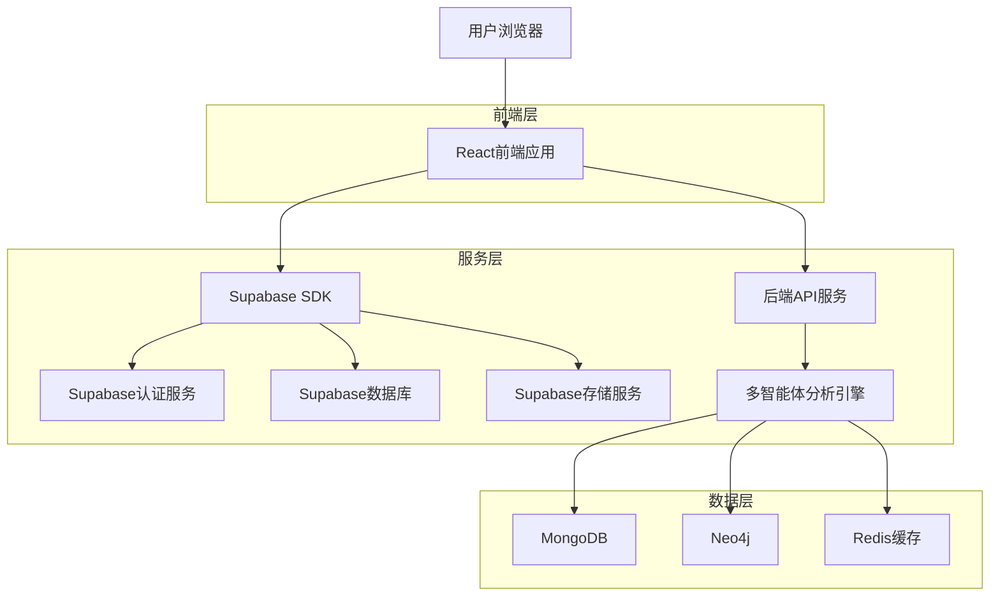
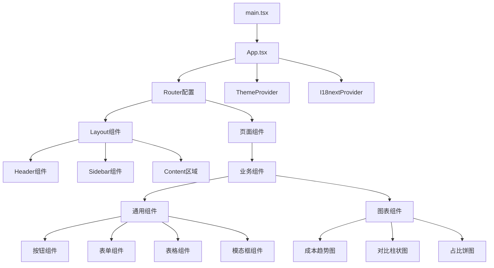

## 1. 架构设计



## 2. 技术描述

- **前端框架**: React@18 + TypeScript@5 + Vite@5
- **UI组件库**: Ant Design@5 + Ant Design Charts
- **状态管理**: React Context + Zustand
- **样式方案**: Tailwind CSS@3 + CSS Modules
- **构建工具**: Vite（开发）+ Rollup（生产）
- **测试框架**: Jest@29 + React Testing Library + Cypress
- **国际化**: react-i18next@13
- **主题管理**: @ant-design/cssinjs@1
- **图表库**: Ant Design Charts + ECharts
- **初始化工具**: vite-init

### 核心依赖包
```json
{
  "dependencies": {
    "react": "^18.2.0",
    "react-dom": "^18.2.0",
    "antd": "^5.12.0",
    "@ant-design/charts": "^1.4.0",
    "react-i18next": "^13.5.0",
    "i18next": "^23.7.0",
    "zustand": "^4.4.0",
    "tailwindcss": "^3.3.0",
    "@supabase/supabase-js": "^2.38.0"
  },
  "devDependencies": {
    "@types/react": "^18.2.0",
    "@types/react-dom": "^18.2.0",
    "@vitejs/plugin-react": "^4.2.0",
    "vite": "^5.0.0",
    "jest": "^29.7.0",
    "@testing-library/react": "^14.1.0",
    "@testing-library/jest-dom": "^6.1.0",
    "cypress": "^13.6.0",
    "eslint": "^8.55.0",
    "prettier": "^3.1.0"
  }
}
```

## 3. 路由定义

| 路由路径 | 页面组件 | 权限要求 | 描述 |
|----------|----------|----------|------|
| /login | LoginPage | 匿名 | 用户登录页面 |
| /dashboard | DashboardPage | 认证用户 | 成本分析仪表板 |
| /drugs | DrugListPage | 认证用户 | 药品列表和成本对比 |
| /analysis | AnalysisPage | 认证用户 | 多维度成本分析 |
| /alerts | AlertPage | 认证用户 | 预警规则设置 |
| /settings | SettingsPage | 认证用户 | 系统和个人设置 |
| /reports | ReportsPage | 高级用户 | 报告生成和管理 |
| /admin | AdminPage | 管理员 | 系统管理后台 |

## 4. API定义

### 4.1 认证相关API

**用户登录**
```
POST /api/auth/login
```

请求参数：
| 参数名 | 类型 | 必需 | 描述 |
|--------|------|------|------|
| email | string | 是 | 用户邮箱地址 |
| password | string | 是 | 用户密码 |

响应数据：
```json
{
  "success": true,
  "data": {
    "user": {
      "id": "uuid",
      "email": "user@example.com",
      "name": "用户名",
      "role": "analyst"
    },
    "token": "jwt_token_string",
    "expiresIn": 3600
  }
}
```

### 4.2 药品数据API

**获取药品列表**
```
GET /api/drugs?page=1&limit=20&search=关键字&category=分类
```

响应数据：
```json
{
  "success": true,
  "data": {
    "items": [
      {
        "id": "drug_001",
        "name": "二甲双胍",
        "category": "降糖药",
        "manufacturer": "厂家A",
        "cost": 12.50,
        "trend": "up",
        "changePercent": 5.2
      }
    ],
    "total": 150,
    "page": 1,
    "limit": 20
  }
}
```

**成本分析数据**
```
POST /api/analysis/cost
```

请求参数：
```json
{
  "dimensions": ["time", "region"],
  "metrics": ["avg_cost", "total_cost"],
  "filters": {
    "dateRange": ["2024-01-01", "2024-12-31"],
    "drugCategories": ["降糖药", "降压药"]
  }
}
```

## 5. 前端架构设计



## 6. 组件架构

### 6.1 组件层次结构
- **页面级组件**: DashboardPage, DrugListPage, AnalysisPage
- **业务组件**: CostOverview, DrugComparison, AnalysisChart
- **通用组件**: DataTable, SearchBar, ExportButton, ThemeToggle
- **基础组件**: 基于Ant Design二次封装的Button、Form、Modal等

### 6.2 组件开发规范
- 使用TypeScript编写，定义清晰的Props接口
- 遵循React Hooks最佳实践
- 实现80%以上的单元测试覆盖率
- 支持主题切换和国际化
- 提供完整的组件文档和示例

### 6.3 状态管理
```typescript
// 全局状态定义
interface AppState {
  user: User | null;
  theme: 'light' | 'dark';
  locale: 'zh-CN' | 'en-US';
  loading: boolean;
}

// 业务状态定义
interface CostAnalysisState {
  drugs: Drug[];
  filters: FilterConfig;
  analysisResult: AnalysisData | null;
}
```

## 7. 测试策略

### 7.1 单元测试
- **测试框架**: Jest + React Testing Library
- **覆盖率要求**: 80%以上
- **测试范围**: 组件、工具函数、自定义Hooks
- **测试重点**: 业务逻辑、数据处理、用户交互

### 7.2 集成测试
- **测试工具**: Cypress
- **测试场景**: 用户操作流程、API集成、错误处理
- **自动化**: CI/CD流水线中自动执行

### 7.3 性能测试
- **性能指标**: 首屏加载时间 < 3s，交互响应时间 < 100ms
- **优化策略**: 代码分割、懒加载、缓存策略

## 8. 构建和部署

### 8.1 构建配置
```typescript
// vite.config.ts
export default defineConfig({
  build: {
    target: 'es2015',
    minify: 'terser',
    rollupOptions: {
      output: {
        manualChunks: {
          vendor: ['react', 'antd'],
          charts: ['@ant-design/charts'],
          utils: ['lodash', 'dayjs']
        }
      }
    }
  },
  plugins: [
    react(),
    compression(),
    visualizer()
  ]
})
```

### 8.2 部署策略
- **静态资源**: 构建后部署到CDN
- **环境配置**: 支持开发、测试、生产环境
- **监控告警**: 集成前端监控和错误上报